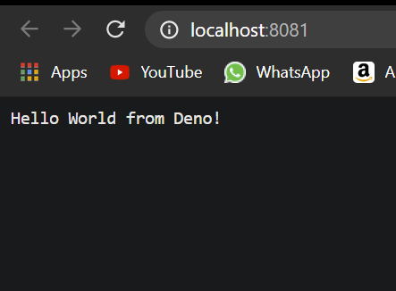

# Hello World from Deno

this is an example hello world project written in typescript and compiled with deno

## Screenshot


## Prerequisite
- Deno

## Setup
- install deno if you dont already have it
```
curl -fsSL https://deno.land/x/install/install.sh | sh
```
-run ./hello_deno.sh from the root folder

### Problems
- if you cant start this server pls refer to the deno install instructions:<br>
https://deno.land/manual@v1.4.6/getting_started/installation
